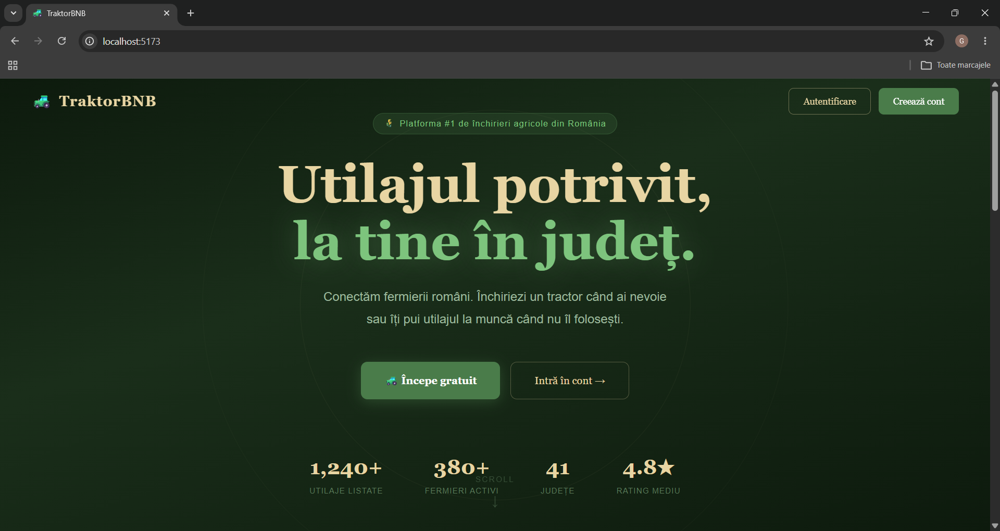
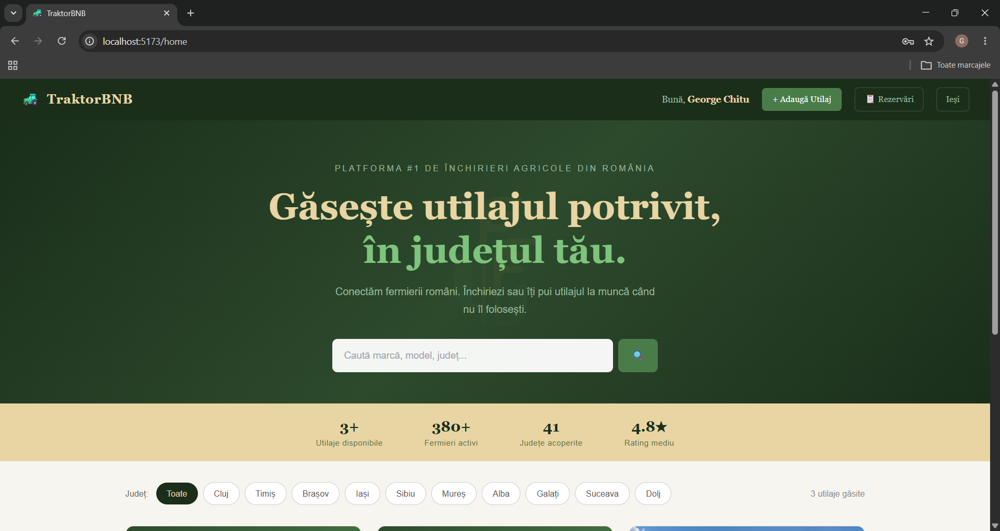
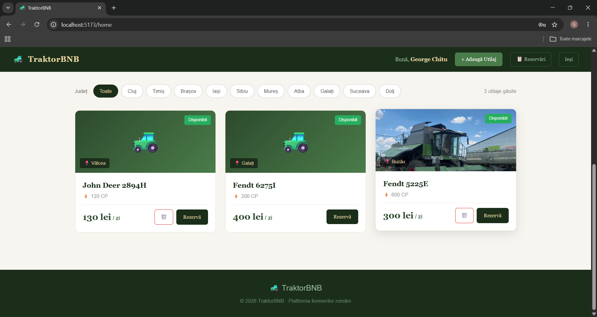
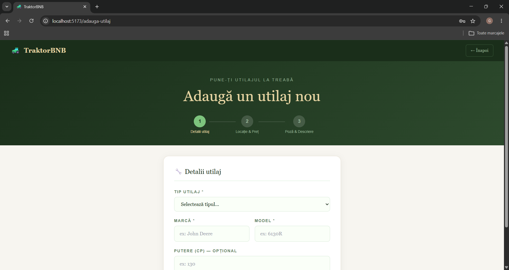

# 🚜 TraktorBNB

**Platform pentru închirierea echipamentelor agricole** | Airbnb pentru ferme

Platformă digitală care conectează proprietarii de echipamente agricole cu fermieri care au nevoie de ele, simplificând procesul de închiriere și gestionare.

---

## 📖 Overview

TraktorBNB este o platformă web fullstack care revolutionează modul în care fermerii accesează echipamentele agricole. Similar cu Airbnb, TraktorBNB permite proprietarilor să-și listeze echipamentele și fermierilor să le închirieze.

### Problemă rezolvată
- ❌ **Înainte:** Fermierii cautau manual echipamente, contacte dificile
- ✅ **Acum:** Platformă centralizată, booking online, evaluări transparente

---

## ✨ Features

### Pentru fermieri
- 🔍 Căutare avansată cu filtrare
- 📅 Booking ușor cu selectare date
- 📱 Responsive design

### Pentru proprietari
- 📊 Dashboard complet
- 📸 Upload imagini cu Cloudinary

### General
- 🔐 Autentificare Firebase sigură
- ✅ Teste automate (toate passing)
- 🐳 Docker containerized

---

## 🛠️ Tech Stack

**Frontend:** React, Tailwind CSS  
**Backend:** FastAPI, PostgreSQL  
**Auth:** Firebase Authentication  
**Storage:** Cloudinary  
**Infrastructure:** Docker

---

## 📸 Screenshots

### 📸 LandingPage


### 🏠 Homepage


### 🔍 Equipment Listing


### 📅 Add Equipment


---

## 🚀 Quick Start

### Cu Docker (Recomand)

```bash
# Clone repository
git clone https://github.com/doruchitu/TraktorBNB.git
cd TraktorBNB

# Start services
docker-compose up

# Accesează:
# Frontend: http://localhost:5173
# Backend: http://localhost:8080
```


---

## 🔌 API Documentation

### Interactive Docs
